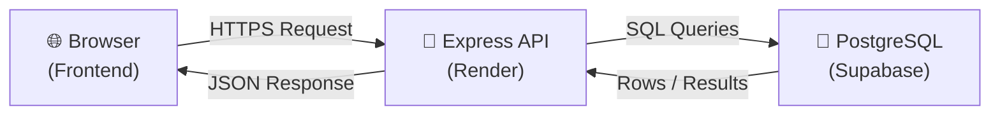

# Money Tracker API

A REST API for a personal expense tracker, built with Node, Express, and PostgreSQL.

## Architecture



Browser → Express API (Render) → PostgreSQL (Supabase)

## Tech stack

- Node.js + Express
- PostgreSQL (via Supabase), accessed with raw parameterized SQL using `pg`
- Deployed on Render

## Running locally

1. `npm install`
2. Copy `.env.example` to `.env` and fill in `DATABASE_URL` (see comment for the correct connection string format)
3. `npm run dev`

## API Contract

Base URL (production): `https://money-tracker-api-xxxx.onrender.com`
Base URL (local): `http://localhost:3000`

### GET /api/transactions

Returns all transactions for the current user, newest first, each enriched with a derived `category`.

**Response 200:**

```json
[
  {
    "id": "uuid",
    "user_id": "uuid",
    "amount": 450,
    "merchant": "Swiggy",
    "date": "2026-06-01",
    "created_at": "2026-06-01T10:00:00.000Z",
    "category": "Food"
  }
]
```

### POST /api/transactions

Creates a new transaction.

**Request body:**

```json
{ "amount": 200, "merchant": "Dunzo", "date": "2026-06-20" }
```

**Response 201:** the created row, same shape as above, including generated `id` and `category`.
**Response 400:** `{ "error": "..." }` — missing fields, non-positive amount, blank merchant, or invalid date.

### DELETE /api/transactions/:id

Deletes a transaction owned by the current user.

**Response 204:** empty body, success.
**Response 404:** `{ "error": "Transaction not found" }` — id doesn't exist or belongs to another user.

### GET /api/summary

Returns aggregated spending data for the current user.

**Response 200:**

```json
{
  "totalByCategory": { "Food": 1100, "Transport": 250, "Subscriptions": 398, ... },
  "recurring": [{ "merchant": "netflix", "amount": 199, "count": 2 }],
  "transactionCount": 10,
  "totalSpent": 4296
}
```

## Security note

Auth tokens are stored in localStorage for simplicity. This is readable by
any JS running on the page (XSS risk). A production app would use httpOnly
cookies instead, which aren't accessible to JavaScript — but that requires
backend cookie handling and CSRF protection. Documented tradeoff, not an
oversight.
